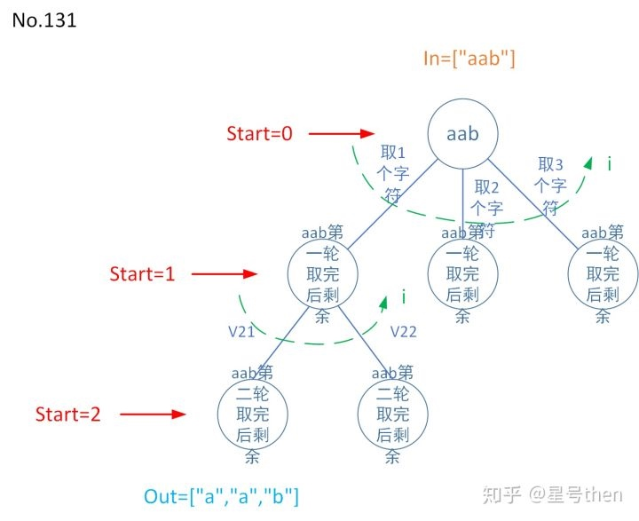

### [131\. Palindrome Partitioning](https://leetcode.com/problems/palindrome-partitioning/)

Difficulty: **Medium**


Given a string _s_, partition _s_ such that every substring of the partition is a palindrome.

Return all possible palindrome partitioning of _s_.

**Example:**

```
Input: "aab"
Output:
[
  ["aa","b"],
  ["a","a","b"]
]
```

#### 树形图：


#### 模板参数说明：

```
in是字符串；
out是分割成回文的字符子串集合；
dict: 从start字符位置开始到in.size()结束这么多的数字，即所有子串长度
(如start=0，in.size()==3，
则dict key1为0，value1为0,1,2；
key2为1，value2为1,2；
key3为2，value为1)；

start是0~in.size()；
i是取的待检验的字符子串长度，遍历dict。
注意每找到一组回文字符子串集合start需要重新归0再找下一组回文字符子串集合，即每次找到一组解后字符还是要还回来，故需要pop_back出栈操作。
如果没有出栈操作下一次out输出会包含上一次out的输出，变成[解1],[解1,解2],[解1,解2,解3]……。
```

#### Solution

Language: **C++**

```c++
class Solution {
private:
    vector<vector<string>> res;
    bool isPalindrome(string s, int start, int end) {
        while (start < end) {
            if (s[start] != s[end]) 
                return false;
            ++start;
            --end;
        }
        return true;
    }
   void partitionDFS(string s, int start, vector<string> &out) {      
       //终止条件 start遍历到字符串最后
        if (start == s.size()) {
            res.push_back(out);
            return;
        }
        for (int i = start; i < s.size(); ++i) {
           if (isPalindrome(s, start, i)) {
                out.push_back(s.substr(start, i - start + 1));
                partitionDFS(s, i + 1, out);
                out.pop_back();
            }
        }
    }
public:
    vector<vector<string>> partition(string s) {
         vector<string> out;
         partitionDFS(s, 0, out);
         return res;
    }
};
```