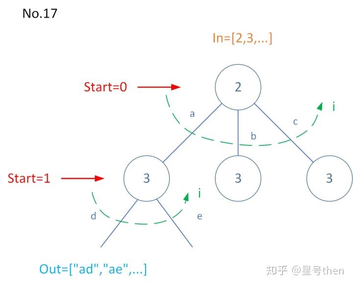

### [17\. Letter Combinations of a Phone Number](https://leetcode.com/problems/letter-combinations-of-a-phone-number/)

Difficulty: **Medium**


Given a string containing digits from `2-9` inclusive, return all possible letter combinations that the number could represent.

A mapping of digit to letters (just like on the telephone buttons) is given below. Note that 1 does not map to any letters.


**Example:**

```
Input: "23"
Output: ["ad", "ae", "af", "bd", "be", "bf", "cd", "ce", "cf"].
```

**Note:**

Although the above answer is in lexicographical order, your answer could be in any order you want.

#### 树形图


#### 模板参数说明：

```
in是数字序列；
out是字符序列；
res是out的集合(以下同理)；
dict: 2->"abc", 3->"def", ……；
start 0~in.size()
```

#### Solution

Language: **C++**

```cpp
// 模板解法
class Solution {
private:
    //1. 
    vector<string> res;
    //3. 字符向数字的映射词典
    const string letterMap[10] = {
        " ", //数字0
        "",  //数字1
        "abc", //数字2
        "def", //数字3
        "ghi", //数字4
        "jkl", //数字5
        "mno", //数字6
        "pqrs", //数字7
        "tuv", //数字8
        "wxyz" //数字9
    };
    //5. in序列是digits数字序列, start是index, out是字符串s
    void findCombination(const string &digits, int index, const string &s){
        //5.1 终止条件
        if(index==digits.size()){
            res.push_back(s);
            return;
        }
        
        char c = digits[index];
        assert(c>='0' && c<='9' && c!='1');
        string letters = letterMap[c-'0']; //in序列中某元素(数字)对应的out元素集合(字符集)
        for(int i = 0; i < letters.size();i++)
            findCombination(digits, index+1, s+letters[i]); //s+letters[i]相当于压栈操作 5.2.3
        return;      
    }
public:
    //6.
    vector<string> letterCombinations(string digits) {
        //6.1
        res.clear();
        //6.2
        if(digits=="")
            return res;
	//6.4
        findCombination(digits,0,"");
	//6.5
        return res;
    }
};
```

```c++
// 迭代解法

class Solution {
public:
    vector<string> letterCombinations(string digits) {
        if(digits.empty()) return vector<string>();
        
        vector<string> res(1, "");
        
        string chars[8] = {"abc", "def", "ghi", "jkl", "mno", "pqrs", "tuv", "wxyz"};
​
        
        for(char d : digits)
        {
            // 注意：每个键使用一个临时数组，
            // 先把res与键的组合写入临时数组中，
            // 再用此临时数组覆盖原数组
            vector<string> now;
            
            for(char c : chars[d - '2'])
            {
                // 原数组与新字符组合，写入临时数组
                for(auto path :res)
                {
                    now.push_back(path + c);
                }
            }
            
            // 写回
            res = now;
        }
        return res;
    }
};
```