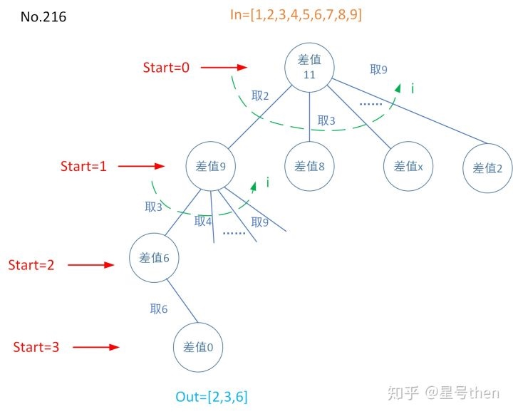

### [216\. Combination Sum III](https://leetcode.com/problems/combination-sum-iii/)

Difficulty: **Medium**


Find all possible combinations of _**k**_ numbers that add up to a number _**n**_, given that only numbers from 1 to 9 can be used and each combination should be a unique set of numbers.

**Note:**

*   All numbers will be positive integers.
*   The solution set must not contain duplicate combinations.

**Example 1:**

```
Input: k = 3, n = 7
Output: [[1,2,4]]
```

**Example 2:**

```
Input: k = 3, n = 9
Output: [[1,2,6], [1,3,5], [2,3,4]]
```

#### 树形图：


#### 模板参数说明：

```in是候选数字集合，即1~n，
out是一个目标解，
dict是给定start数字后从start数字到9，
start是从1开始的数字，
i遍历dict，start数字~9；

和No.39、No40有着类似之处，
给定了候选数字，
给定了求和的数字个数，
终止条件的递归求差为0需要再加强一下，
即求和数字的数量是k。
```

#### Solution

Language: **C++**

```c++
class Solution {
private:
    vector<vector<int>> res;
    void combinationSum3DFS(int k, int n, int start, vector<int>& out){
        if(n<0)
            return;
        if(n==0 && out.size()==k){
            res.push_back(out);
            return;
        }
            
        for(int i=start; i<=9;++i){    
            out.push_back(i);
            combinationSum3DFS(k, n-i, i+1, out); //求和就是递归作差
            out.pop_back();           
        }
        return;
    }
public:
    vector<vector<int>> combinationSum3(int k, int n) {
        if(k<=0 || n<=0)
            return res;
        vector<int> out;
        combinationSum3DFS(k, n, 1, out);
        return res;
    }
};
```