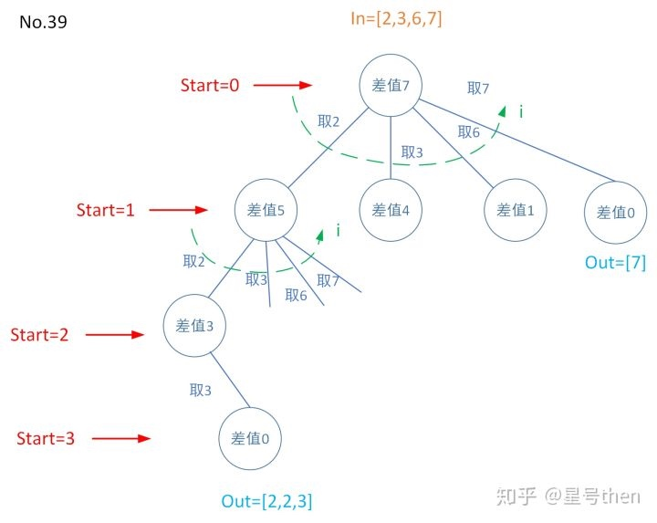

### [39\. Combination Sum](https://leetcode.com/problems/combination-sum/)

Difficulty: **Medium**


Given a **set** of candidate numbers (`candidates`) **(without duplicates)** and a target number (`target`), find all unique combinations in `candidates` where the candidate numbers sums to `target`.

The **same** repeated number may be chosen from `candidates` unlimited number of times.

**Note:**

*   All numbers (including `target`) will be positive integers.
*   The solution set must not contain duplicate combinations.

**Example 1:**

```
Input: candidates = [2,3,6,7], target = 7,
A solution set is:
[
  [7],
  [2,2,3]
]
```

**Example 2:**

```
Input: candidates = [2,3,5], target = 8,
A solution set is:
[
  [2,2,2,2],
  [2,3,3],
  [3,5]
]
```

#### 树形图：


#### 模板参数说明：

```
in是候选数字集合，
out是一个目标解，
dict是给定start位置后从start位置数到集合尾的所有数，
start是从候选数字第一个开始找，
i遍历dict，start~candidates.size()；
类似于No.77。

所谓DFS求和就是递归作差，
不断的计算target和候选数字的差，
终止条件为直至这个差为0(找到)，
这个差为负数(未在候选数字找到解)，
target只是终止条件以及用来递归求和每次计算差值，
类似于No.77的k。
此问题是数异多用(给定的数没有重复，每个数只能用一次)。
下一个问题是数同单用(给定数有重复，重复的只能用一次)。
```

#### Solution

Language: **C++**

```c++
class Solution {
private:
    vector<vector<int>> res;
    void combinationSumDFS(vector<int>& candidates, int target, int start, vector<int>& out){
        //终止条件有两个
        if (target < 0) 
            return;
        if (target == 0) {
            res.push_back(out);
            return;
        }
        for (int i = start; i < candidates.size(); ++i) {
           out.push_back(candidates[i]);
           combinationSumDFS(candidates, target - candidates[i], i, out);
           out.pop_back();
        }
        return;
    }
public:
    vector<vector<int>> combinationSum(vector<int>& candidates, int target) {
        res.clear();
        if(candidates.size()==0)
            return res;
        vector<int> out;
        combinationSumDFS(candidates, target, 0, out);
        return res;
    }
};
```