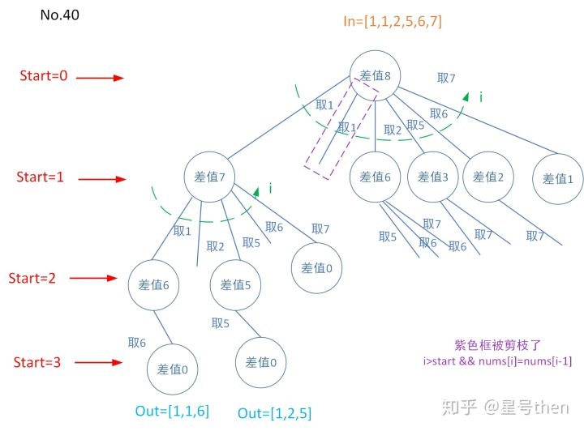

### [40\. Combination Sum II](https://leetcode.com/problems/combination-sum-ii/)

Difficulty: **Medium**


Given a collection of candidate numbers (`candidates`) and a target number (`target`), find all unique combinations in `candidates` where the candidate numbers sums to `target`.

Each number in `candidates` may only be used **once** in the combination.

**Note:**

*   All numbers (including `target`) will be positive integers.
*   The solution set must not contain duplicate combinations.

**Example 1:**

```
Input: candidates = [10,1,2,7,6,1,5], target = 8,
A solution set is:
[
  [1, 7],
  [1, 2, 5],
  [2, 6],
  [1, 1, 6]
]
```

**Example 2:**

```
Input: candidates = [2,5,2,1,2], target = 5,
A solution set is:
[
  [1,2,2],
  [5]
]
```

#### 树形图：


#### 模板参数说明：

```
in是候选数字集合，
out是一个目标解，
dict是给定start位置后从start位置数到集合尾的所有数，
start是从候选数字第一个开始找，
i遍历dict，start~candidates.size()；
类似于No.77。

所谓DFS求和就是递归作差，类似于No.39，
但此问题是数同单用(给定数有重复，重复数字的使用次数不能超过该数字重复的个数)。

对于"重复且仅能取一次"问题使用sort排序使得相同的数挨在一起，
再在递归前进行判断，
相同数字跳转到最后一个再进行使用。
```


#### Solution

Language: **C++**

```c++
class Solution {
private:
    vector<vector<int>> res;
    void combinationSum2DFS(vector<int>& candidates, int target, int start, vector<int>& out){
        //终止条件有两个
        if (target < 0) 
            return;
        if (target == 0) {
            res.push_back(out);
            return;
        }
        for (int i = start; i < candidates.size(); ++i) {
            if(i>start && candidates[i]==candidates[i-1])
                continue;
           out.push_back(candidates[i]);
           combinationSum2DFS(candidates, target - candidates[i], i+1, out);
           out.pop_back();
        }
        return;
    }
public:
    vector<vector<int>> combinationSum2(vector<int>& candidates, int target) {
        res.clear();
        if(candidates.size()==0)
            return res;
        vector<int> out;
        sort(candidates.begin(),candidates.end());
        combinationSum2DFS(candidates, target, 0, out);
        return res;
    }
​
};
```