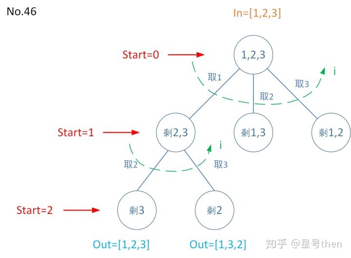

### [46\. Permutations](https://leetcode.com/problems/permutations/)

Difficulty: **Medium**


Given a collection of **distinct** integers, return all possible permutations.

**Example:**

```
Input: [1,2,3]
Output:
[
  [1,2,3],
  [1,3,2],
  [2,1,3],
  [2,3,1],
  [3,1,2],
  [3,2,1]
]
```

#### 树形图：


#### 模板参数说明：

```
in是数字集合；
out是给定数的一个全排列；
dict: in取了数之后其余的数组成的集合，暂时称为剩余集合；
start是0~in.size()；
i是取剩余集合的数(即in没取的数)，实现了对dict的遍历。
注意start需要回到in原始位置再求下一个解，所以有出栈操作；
每次in取数后集合都会发生变化，所以要有used标记。
```


#### Solution

Language: **C++**

```c++
class Solution {
private:
    vector<vector<int>> res;
    vector<bool> used;
    void permuteDFS(vector<int>&nums, int index, vector<int>& out){
        if(index==nums.size()){
            res.push_back(out);
            return;
        }     
        for(int i=0;i<nums.size();i++){
            if(!used[i]){
                out.push_back(nums[i]);
                used[i]=true;
                permuteDFS(nums,index+1,out);
                out.pop_back();
                used[i]=false;
            }
        }
     return;
            
    }
public:
    vector<vector<int>> permute(vector<int>& nums) {
        res.clear();
        if(nums.size()==0)
            return res;
       used = vector<bool>(nums.size(), false);
        vector<int> p;
        permuteDFS(nums, 0, p);
        return res;
    }
};
```