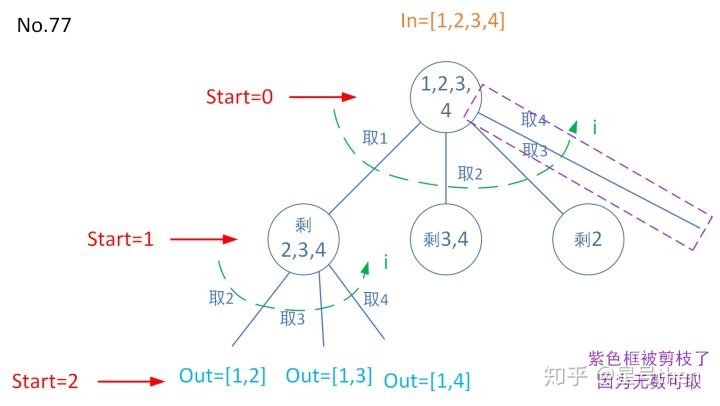

### [77\. Combinations](https://leetcode.com/problems/combinations/)

Difficulty: **Medium**


Given two integers _n_ and _k_, return all possible combinations of _k_ numbers out of 1 ... _n_.

**Example:**

```
Input: n = 4, k = 2
Output:
[
  [2,4],
  [3,4],
  [2,3],
  [1,2],
  [1,3],
  [1,4],
]
```

#### 树形图：


#### 模板参数说明：

```
in是数字集合；
out是给定数的一个组合；
dict: in取了数之后其余的数组成的集合，暂时称为剩余集合；
start是1~k；i是取剩余集合的数(即in没取的数)，实现了对dict的遍历。

注意和排列三点不同：

1). 排列每求完一解之后需要start回到原in位置求下一解，
组合本质上start也是回原in位置，
所以必须有出栈操作，
不同的是in的集合每求完一个解则剔除了刚才用过的数，
集合变小了，dict中也剔除了这个用过的数，
与start只遍历一次(如No.17)不一样。

2). i从start开始，不再从0开始，所以也不用在递归前记录这个数是否被用过。

3). 拿[1,2,3,4]，k=2要取两个数例子来说，
到第一层树枝最后一个位置，
即集合就in就只剩下[4]了，
start==0，取4后没有第二个数可以取了，
所以没必要遍历到这个位置，可以对树进行剪枝，
即for(int i=start; i<=n; ++i)改为for(int i=start; 
i<=n-(k-c.size())+1; ++i)，
看还有没有那么多数能取了。
```

#### Solution

Language: **C++**

```c++
class Solution {
private:
    vector<vector<int>> res;
    //已找到的每次的组合在c中，所有的组合在res中，start是从哪个数开始查找
    void generateCombine(int n, int k, int start, vector<int>& c)
    {
        //终止条件
        if(c.size()==k){
            res.push_back(c);
            return; 
        }
        for(int i=start; i<=n-(k-c.size())+1; ++i){ 
            c.push_back(i);
            generateCombine(n,k,i+1,c);
            c.pop_back();
        }
        return;    
    }
public:
    vector<vector<int>> combine(int n, int k) {
        res.clear();
        if(n<=0 || k<=0 || k>n)
            return res;
        vector<int> c;
        generateCombine(n,k,1,c);
        return res;
    }
};
```