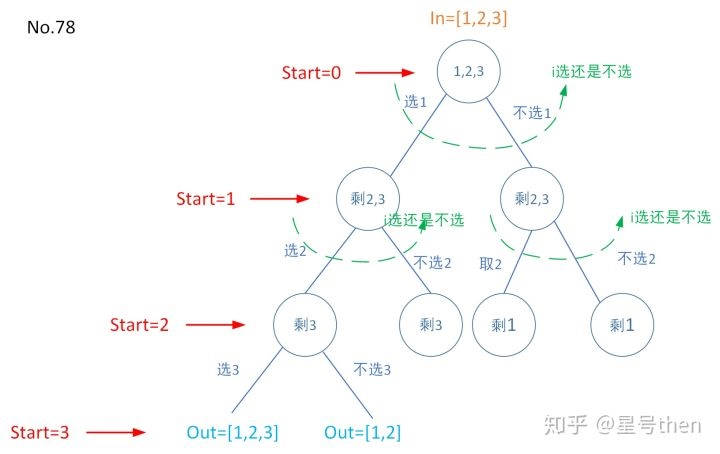

### [78\. Subsets](https://leetcode.com/problems/subsets/)

Difficulty: **Medium**


Given a set of **distinct** integers, _nums_, return all possible subsets (the power set).

**Note:** The solution set must not contain duplicate subsets.

**Example:**

```
Input: nums = [1,2,3]
Output:
[
  [3],
  [1],
  [2],
  [1,2,3],
  [1,3],
  [2,3],
  [1,2],
  []
]
```

#### 树形图：


#### 模板参数说明：

```
in就是集合本身，
注意[1,2,3]应该是从空集开始，
感觉如同四个元素[空,1,2,3]，
但一旦子集合有其他元素，
就不能再由空元素(如不存在[空,1]或[空,2],
只能是[1],[2])；

out是一个子集；

start从in序列从头到尾遍历，
但其实是遍历很多遍，故有出栈；

dict是选这个元素或不选这个元素，
即元素隐性属性选还是不选；

i就是选还是不选，本质上就是一个二叉树。
```

#### Solution

Language: **C++**

```cpp
// 模板方法

class Solution {
private:
    vector<vector<int>> res;
    void subsetsDFS(vector<int>& nums, int start, vector<int>& out){
        if(start==nums.size()){
	        res.push_back(out);
            return;
        }
        for(int i = 0; i<2; ++i){ //这样写纯粹是废话，但是套用到模板框架中更好理解，其实这里的for和if都可以省略，但删掉了之后代码会不好理解
	        if(i==0){
                out.push_back(nums[start]);
                subsetsDFS(nums,start+1,out);
                out.pop_back();
	        }
	        else{
	            subsetsDFS(nums,start+1,out);            
            }
        }    
    }
public:
    vector<vector<int>> subsets(vector<int>& nums) {
        res.clear();
        sort(nums.begin(),nums.end());
        vector<int> out;
        subsetsDFS(nums,0,out);
        return res;
    }
};
```

```c++
class Solution {
public:
    vector<vector<int>> subsets(vector<int>& nums) {
        // dfs回溯
        vector<int> tmp;
        vector<vector<int>> res;
        
        dfs(nums, 0, tmp, res);
        
        return res;
        
    }
    
    void dfs(vector<int> & nums, int i, vector<int> & tmp, vector<vector<int>> & res)
    {
        if(i >= nums.size())
        {
            // 把叶节点的状态加入
            res.push_back(tmp);
            
            return ;
        }
        
        tmp.push_back(nums[i]);
        
        dfs(nums, i + 1, tmp, res);
        
        // 恢复现场
        tmp.pop_back();
​
        dfs(nums, i + 1, tmp, res);
    }
};
```