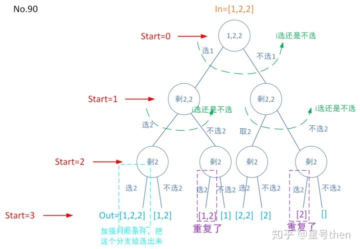

### [90\. Subsets II](https://leetcode.com/problems/subsets-ii/)

Difficulty: **Medium**


Given a collection of integers that might contain duplicates, **_nums_**, return all possible subsets (the power set).

**Note:** The solution set must not contain duplicate subsets.

**Example:**

```
Input: [1,2,2]
Output:
[
  [2],
  [1],
  [1,2,2],
  [2,2],
  [1,2],
  []
]
```

#### 树形图：


#### 模板参数说明：

```
无
```

#### Solution

Language: **C++**

```cpp
// 模板方法

class Solution {
private:
    vector<vector<int>> res;
    void subsetsWithDupDFS(vector<int>& nums, int start, vector<int>& out){
        if(start==nums.size()){
	        res.push_back(out);
            return;
        }

        int same_num_start=start;
        while(same_num_start >=0 && nums[same_num_start] == nums[start]) same_num_start--;
        same_num_start++;//[1,2,2]中第一个2的位置
        int same_num_counts = start - same_num_start + 1; //共有几个相同的数字

        for(int i = 0; i<2; ++i){ //这样写纯粹是废话，但是套用到模板框架中更好理解
	        if(i==0){
                 if(same_num_counts==1 //没有重复的数字
                    || (out.size()>=same_num_counts-1 && out[out.size()-same_num_counts+1]==nums[start]) //有重复的数字，且都是这个数字
                    ){
                    out.push_back(nums[start]);
                    subsetsWithDupDFS(nums,start+1,out);
                    out.pop_back();
	            }
            }
	        else{
	            subsetsWithDupDFS(nums,start+1,out);            
            }
        }  
    }    
public:
    vector<vector<int>> subsetsWithDup(vector<int>& nums) {
        vector<int> out;
        sort(nums.begin(),nums.end());
        subsetsWithDupDFS(nums,0,out);
        return res;
    }
};
```

```c++
class Solution {
public:
    
    vector<vector<int>> ans;
    
    vector<int> path;
    
    
    vector<vector<int>> subsetsWithDup(vector<int>& nums) {
        sort(nums.begin(), nums.end());
        
        dfs(nums, 0);
        
        return ans;
    }
    
    void dfs(vector<int> & nums, int u)
    {
        if(u == nums.size())
        {
            ans.push_back(path);
            
            return ;
        }
        
        // 计算当前数字个数
        int k = 0;
        while(u + k < nums.size() && nums[u + k] == nums[u])
        {
            ++ k;
        }
        
        //看看几个连续的数
        for(int i = 0; i <= k; ++ i)
        {
            dfs(nums, u + k);
            
            path.push_back(nums[u]);
            //也就是连续加了多少次nums[u] 前后导致重复出现  递归变成nums[u]连续出现几次 也就是对象是一连串的数字而非一连串的数字中的一个一个
            //而且是按顺序个数递增 所以不用考虑 2（1） 2（2） 和2（2） 2（1）元素位置上的变化
            //只是求子集 所以每个数只考虑选不选 而不需考虑顺序
        }
        
        
        // 恢复现场
        for(int i = 0; i <= k; ++ i)    //恢复现场 吐出来
        {
            path.pop_back();
        }
    }
};
```