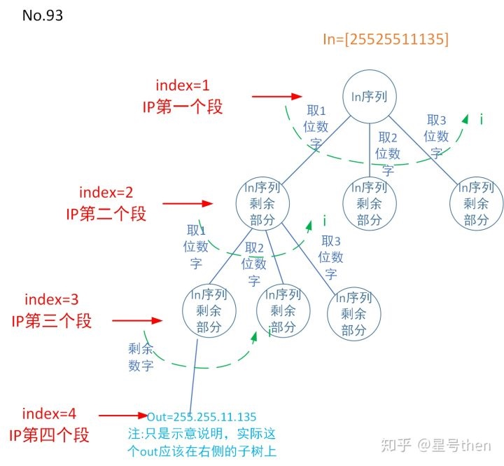

### [93\. Restore IP Addresses](https://leetcode.com/problems/restore-ip-addresses/)

Difficulty: **Medium**


Given a string containing only digits, restore it by returning all possible valid IP address combinations.

**Example:**

```
Input: "25525511135"
Output: ["255.255.11.135", "255.255.111.35"]
```

#### 树形图：


#### 模板参数说明：

```
in是数字字符序列(即每个字符都是一个数字)；
out是由.分割的4段数字；
dict: 数字字符->1位数字、2位数字、3位数字；
start是1~4，代表IPv4的四个段；
i是1~3，遍历dict 1位数字、2位数字还是3位数字
```

#### Solution

Language: **C++**

```c++
class Solution {
private:
    //1. 
    vector<string> res;
    //2. 
    bool isValid(string s) {
        if (s.empty() || s.size() > 3 || (s.size() > 1 && s[0] == '0')) 
            return false;
        int res = atoi(s.c_str());
        return res <= 255 && res >= 0;
    }
    //5. in序列是字符串s, start是index，在这里是IP的每个段(由点来分割), out是一组IP划分
    void findIPAddress(string s, int index, string out){
        //5.1终止条件，代码还可以优化提前终止，比如剩余字符串长度和index比对：index=3时 s.length()<=9；index=2时 s.length()<=6；index=1时 s.length()<=3
        if(index==5){
            if(s.empty()){
                res.push_back(out);
                return;
            }
            return;
        }
	//5.2 主循环
        for (int i = 1; i <= 3; ++i) { 
                if (s.size() >= i && isValid(s.substr(0, i))) { //5.2.2 额外判定条件
                    if (index == 4) //IP地址的第四个段
                        findIPAddress(s.substr(i), index + 1, out + s.substr(0, i)); //
                    else 
                        findIPAddress(s.substr(i), index + 1, out + s.substr(0, i) + ".");
                }
       }
        
    }
public:
//6.
    vector<string> restoreIpAddresses(string s) {
        findIPAddress(s, 1, "");
        return res;
    }
};
```