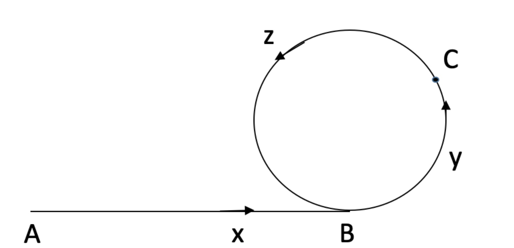

### [142\. Linked List Cycle II](https://leetcode.com/problems/linked-list-cycle-ii/)

Difficulty: **Medium**


Given a linked list, return the node where the cycle begins. If there is no cycle, return `null`.

To represent a cycle in the given linked list, we use an integer `pos` which represents the position (0-indexed) in the linked list where tail connects to. If `pos` is `-1`, then there is no cycle in the linked list.

**Note:** Do not modify the linked list.

**Example 1:**

```
Input: head = [3,2,0,-4], pos = 1
Output: tail connects to node index 1
Explanation: There is a cycle in the linked list, where tail connects to the second node.
```


**Example 2:**

```
Input: head = [1,2], pos = 0
Output: tail connects to node index 0
Explanation: There is a cycle in the linked list, where tail connects to the first node.
```


**Example 3:**

```
Input: head = [1], pos = -1
Output: no cycle
Explanation: There is no cycle in the linked list.
```


**Follow-up**:  
Can you solve it without using extra space?


#### Solution

题解：使用快慢指针，快指针每次走两格，慢指针每次走一格，当两个指针第一次相遇的时候，将慢指针返回起始点，然后快慢指针每次走一格，再次相遇就是环的入口节点。


证明：假设A是链表起点，B是链表环的入口，C是二者第一次相遇的地方。AB，BC，CB的距离分别为x,y,z，那么环的长度就是y+z。二者第一次相遇时，可以知道二者分别走过的距离是：

slow:x+y+k1(y+z)
quick:x+y+k2(y+z)
因为快节点走过的距离是慢节点的两倍：2(x+y+k1(y+z))=x+y+k2(y+z)
可以得到x+y=(k2−k1)(y+z)
进一步得到x=(k2−k1−1)(y+z)+z
也就是说AB之间的距离是整数倍个环长度加上CB的长度。那么如果两个节点分别在A，C两点开始走，一个节点从A走到B，dist=x，另一个节点必然也会同时到达B，dist=(k2−k1−1)(y+z)+z。

Language: **C++**

```c++
/**
 * Definition for singly-linked list.
 * struct ListNode {
 *     int val;
 *     ListNode *next;
 *     ListNode(int x) : val(x), next(NULL) {}
 * };
 */
class Solution {
public:
    ListNode *detectCycle(ListNode *head) {
        // 首先，慢指针走一步，快指针走两步
        // 相遇后，慢指针回到起点，快慢指针同时走一步，再次相遇时即为环入口
        
        if(! head || ! head -> next) return 0;  // 空或只有一个元素，无环
        
        ListNode * slow = head;
        ListNode * quick = head;
        
        while(quick && quick -> next)   // 此处对所有位置的quick做判断
        {
            slow = slow -> next;
            quick = quick -> next -> next;
            
            if(slow == quick)
            {
                slow = head;
                
                while(slow != quick)
                {
                    slow = slow -> next;
                    quick = quick -> next;
                }
                // 快慢指针相遇了而且之后以相同速度走，再次相遇，返回相遇位置
                return slow;
            }
        }
        // 快指针走到NULL
        return 0;
    }
};
```