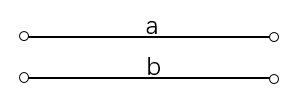
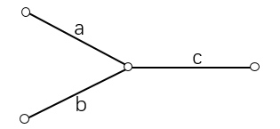

### [160\. Intersection of Two Linked Lists](https://leetcode.com/problems/intersection-of-two-linked-lists/)

Difficulty: **Easy**


Write a program to find the node at which the intersection of two singly linked lists begins.

For example, the following two linked lists:

begin to intersect at node c1.

**Example 1:**

```
Input: intersectVal = 8, listA = [4,1,8,4,5], listB = [5,0,1,8,4,5], skipA = 2, skipB = 3
Output: Reference of the node with value = 8
Input Explanation: The intersected node's value is 8 (note that this must not be 0 if the two lists intersect). From the head of A, it reads as [4,1,8,4,5]. From the head of B, it reads as [5,0,1,8,4,5]. There are 2 nodes before the intersected node in A; There are 3 nodes before the intersected node in B.
```

**Example 2:**

```
Input: intersectVal = 2, listA = [0,9,1,2,4], listB = [3,2,4], skipA = 3, skipB = 1
Output: Reference of the node with value = 2
Input Explanation: The intersected node's value is 2 (note that this must not be 0 if the two lists intersect). From the head of A, it reads as [0,9,1,2,4]. From the head of B, it reads as [3,2,4]. There are 3 nodes before the intersected node in A; There are 1 node before the intersected node in B.
```

**Example 3:**

```
Input: intersectVal = 0, listA = [2,6,4], listB = [1,5], skipA = 3, skipB = 2
Output: null
Input Explanation: From the head of A, it reads as [2,6,4]. From the head of B, it reads as [1,5]. Since the two lists do not intersect, intersectVal must be 0, while skipA and skipB can be arbitrary values.
Explanation: The two lists do not intersect, so return null.
```

**Notes:**

*   If the two linked lists have no intersection at all, return `null`.
*   The linked lists must retain their original structure after the function returns.
*   You may assume there are no cycles anywhere in the entire linked structure.
*   Your code should preferably run in O(n) time and use only O(1) memory.


#### Solution

(链表，指针扫描) O(n)
这题的思路很巧妙，我们先给出做法，再介绍原理。

算法步骤：

1. 用两个指针分别从两个链表头部开始扫描，每次分别走一步；
2. 如果指针走到null，则从另一个链表头部开始走；
3. 当两个指针相同时，
* 如果指针不是null，则指针位置就是相遇点；
* 如果指针是 null，则两个链表不相交；

此题我们画图讲解，一目了然：

1. 两个链表不相交：
 

a,b 分别代表两个链表的长度，则两个指针分别走 a+b+1+1 步后都变成 null。

2. 两个链表相交：
 

则两个指针分别走 a+b+c+1+1 步后在两链表交汇处相遇。

时间复杂度分析：每个指针走的长度不大于两个链表的总长度，所以时间复杂度是 O(n)。


Language: **C++**

```c++
/**
 * Definition for singly-linked list.
 * struct ListNode {
 *     int val;
 *     ListNode *next;
 *     ListNode(int x) : val(x), next(NULL) {}
 * };
 */
class Solution {
public:
    ListNode *getIntersectionNode(ListNode *headA, ListNode *headB) {
        ListNode * p = headA, * q = headB;
        
        // 指针经历了从指向尾部到指向NULL，从指向NULL到指向另一链表的头部，
        // 因此循环的次数为不重叠部分长度加上重叠部分长度再加2
        while(p != q)
        {
            if(p) p = p -> next;
            else p = headB;
            
            if(q) q = q -> next;
            else q = headA;
        }
        
        return p;
    }
};
```