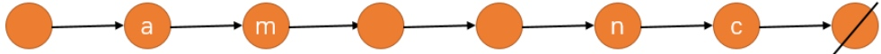
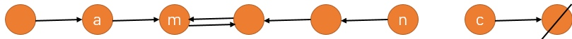
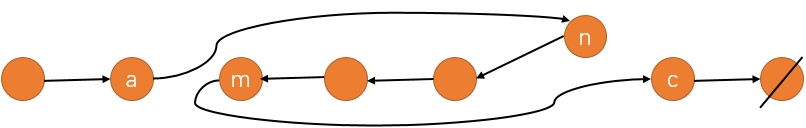

### [92\. Reverse Linked List II](https://leetcode.com/problems/reverse-linked-list-ii/)

Difficulty: **Medium**


Reverse a linked list from position _m_ to _n_. Do it in one-pass.

**Note: **1 ≤ _m_ ≤ _n_ ≤ length of list.

**Example:**

```
Input: 1->2->3->4->5->NULL, m = 2, n = 4
Output: 1->4->3->2->5->NULL
```


#### Solution

p 相当于 a，prev 最初指向 m，相当于 b，cur 相当于 c，next 相当于 d

(模拟) O(n)
假设初始链表如下所示：


第一步，我们先将 m 到 n 之间的指针翻转（不包含第 m 个节点），如下所示：


第二步我们将 m 的指针指向 c，将 a 的指针指向 n，如下所示：


此时我们就完成了 m 到 n 之间的翻转！

时间复杂度分析：整个链表只遍历了一遍，所以时间复杂度是 O(n)。

Language: **C++**

```c++
/**
 * Definition for singly-linked list.
 * struct ListNode {
 *     int val;
 *     ListNode *next;
 *     ListNode(int x) : val(x), next(NULL) {}
 * };
 */
class Solution {
public:
    ListNode* reverseBetween(ListNode* head, int m, int n) {
        // m - 1 指向 n，m 指向 n + 1，m + 1 ~ n 的指向反转
        
        if(m == n) return head;
        
        ListNode * dummy = new ListNode(-1);
        dummy -> next = head;
        
        ListNode * p = dummy;
        
        for(int i = 0; i < m - 1; ++ i) p = p -> next;  // p 指向 m - 1
        
        ListNode * prev = p -> next;    // prev 指向 m
        ListNode * cur = prev -> next;  // cur 指向 m + 1
        
        // prev 、 cur 移动 n - m 次，最终 prev 指向 n，cur 指向 n + 1
        for(int i = m + 1; i <= n; ++ i)
        {
            ListNode * next = cur -> next;
            
            cur -> next = prev;
            
            prev = cur;
            cur = next;
        }
        
        // 先改变 m 的 next 指向，再改变 m - 1 的 next 指向
        p -> next -> next = cur;
        p -> next = prev;
        
        return dummy -> next;
    }
};
```